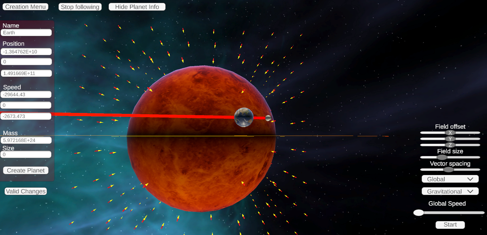
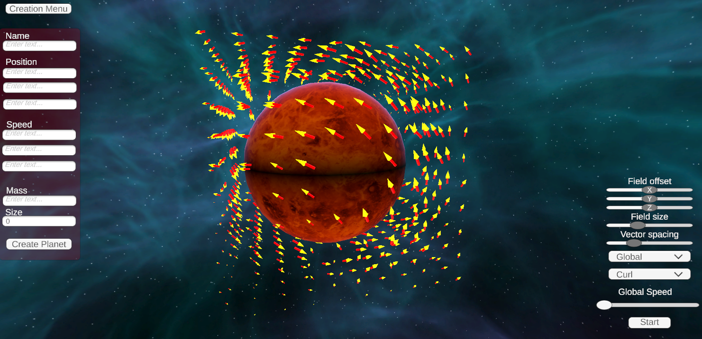
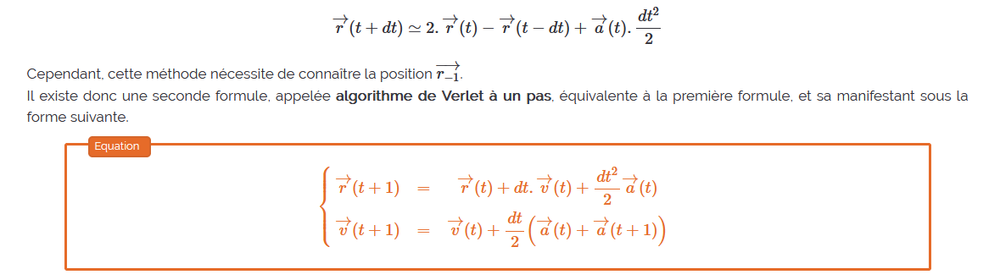
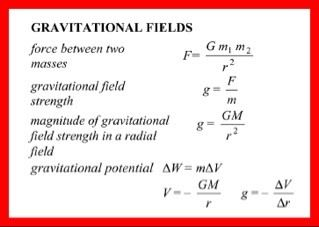

# Project Gravitational Fields

**Group :DEVINE Vincent, GOUPIL Kristian and LISE Omaya**

For ISART Digital

 

## **Project description :**
We created a simulation of a solar system accounting for gravitational fields with Unity engine.

## **To build and run the project :** 
Use the build (launch the .exe) or open the project in Unity.
 

## **Features:** 
Camera :

- Free camera
- Orbit mode

Planet creation  
Planet values modification

## **UI:** 
Buttons :
- Create Menu : Show menu used to create planets
- Orbit Mode : Enable/Disable orbit mode if a planet is already selected
- Show Planet Info : Show/Hide infos (name, position, speed and mass) if a planet is selected
- Pause/Play 
- Gravitional field type (gravitational, curl and clean)
- Gravitional size (global, planets and fields lines)

Sliders:
- Gravitational fields offset in X, Y and Z
- Gravitational fields size 
- Vectors spacing 
- Global speed

## **Commands/Buttons :**
- WASD : move around 
- Mouse scroll : zoom/dezoom
- Right Click : look around 

## **Formula used :**
Trajectory :  

Gravitational Field :  

Engine : Unity 2021.3.18f1  
System : Windows
