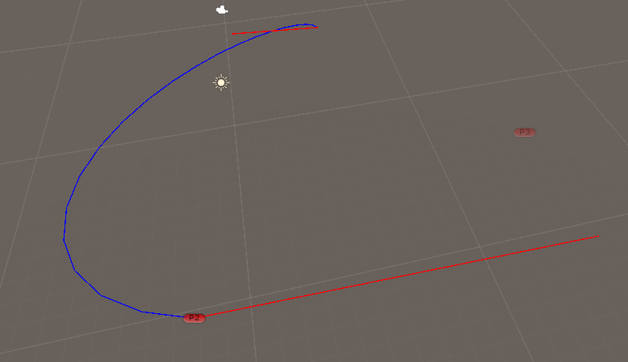
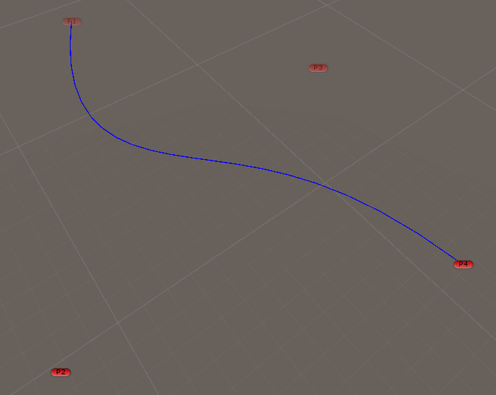
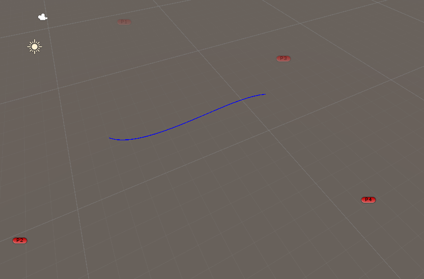
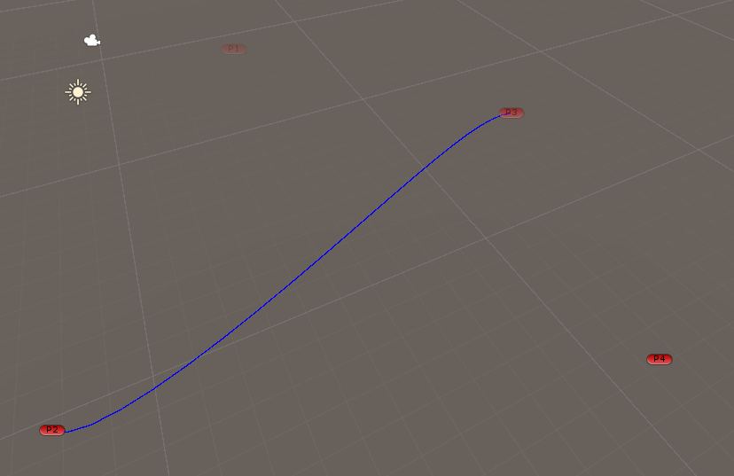

# Spline
Project that aims to learn creation of an **tool editor** for creating and editing **spline curves**.<br>
Exercice doing during 3rd year at ISART.

## Table of content ##
 - [Results](#results)
 - [Quick Start](#quick-start)
 - [Project Description](#project-description)
 - [Use](#use)
 - [Technology](#technology)
 - [Credit](#credit)

 ## Results
 ### Hermite
 <br>
 ### Bezier
 <br>
 ### B-Spline
 <br>
 ### Catmull Rom
 <br>

## Quick Start ##
1. Clone the project: ``` git clone git@gitlabstudents.isartintra.com:projets/2023_gp_2026_spline_editor_gp_2026_spline_editor-gp3_devine_v.git ``` *(by shh)*
2. Open the Unity project
3. Open ```Spline``` scene

## Project description ##
You need to create a tool for creating, editing and using Spline curves.<br>
You will then use this tool to apply Spline curves or surfaces.

You will implement at least the following features
- [x] Hermite, Bezier, B-Spline, Catmull-Rom spline curve point calculation
- [x] Curve display (Gizmos mode)
- [x] Real-time modification of control points
- [x] Data saving and loading

## Use
### Select spline type
On the ```SplineEditor``` GameObject, you can change the spline type between 4 type: 
- Hermite
- Bezier
- BSpline
- Catmull Rom

### Modify curve
Depending on spline type, you can change the position of the GameObject used to give a point in the world for calculations. These GameObjects are called P1, P2, P3 and P4.<br>
Especially for **Hermite spline**, you'll need to modify the direvatives use in GameObject SplineEditor inspector

## Technology ##
- Engine : Unity *2022.3.4f1*
- Text Editor : Visual Studio *2022*
- Versionning : [Gitlab](https://gitlabstudents.isartintra.com/projets/2023_gp_2026_spline_editor_gp_2026_spline_editor-gp3_devine_v)

## Credit ##
Project done at **ISART DIGITAL** <br>
Author : Vincent DEVINE <br>
Special thanks : Florian Wolf <br>

### Date
Start: 01-18-2024<br>
End *(Gold)*: 01-28-2024<br>